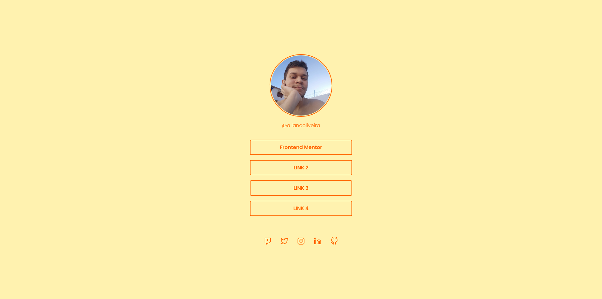

# Rocketseat - Social tree challenge

Challenge from rocketseat with a bit of personal style and info.

## Table of contents

- [Overview](#overview)
    - [Screenshot](#screenshot)
    - [Links](#links)
- [My process](#my-process)
  - [Built with](#built-with)
- [Author](#author)

## Overview

### Screenshot

### Links

- [Repository](https://github.com/jAllanOli/social-tree)
- [WebPage](https://jallanoli.github.io/social-tree/)

## My process

### Built with

- Semantic HTML5 markup
- CSS custom properties
- Flexbox

## Author

- Frontend Mentor - [@jAllanOli](https://www.frontendmentor.io/profile/jAllanOli)
- GitHub - [@jAllanOli](https://github.com/jAllanOli)
